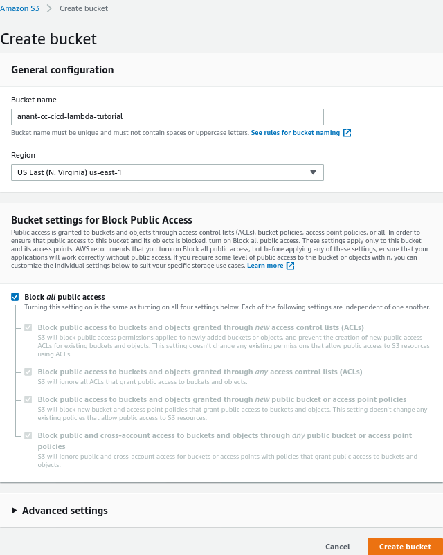
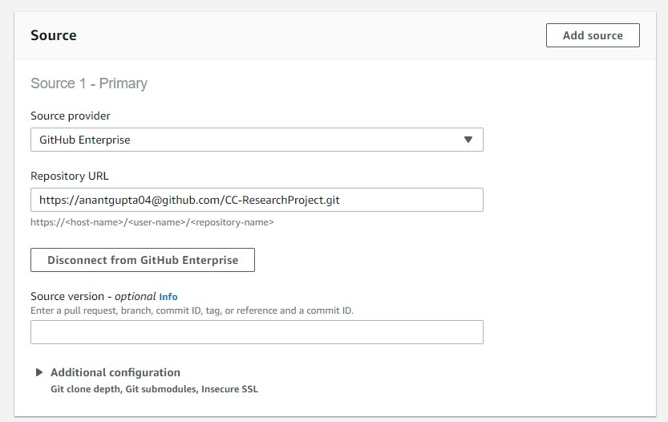

# CI / CD for AWS Lambda

## Table Of Contents

1. [What is CI and CD](#what-is-ci-and-cd)
2. [AWS services For CI/CD](#aws-services-for-cicd)
    1. Code Build
    2. Code Deploy
    3. Code Pipeline
3. [Problem Statement](#problem-statement)
4. [Create a Lambda](#create-a-lambda)

***

## What is CI and CD

***

## AWS Services For CI/CD

***

## Problem Statement
We want to create a lambda function that will be tested and deployed if test pass.
1. A new commit reaches Github
2. Build pipeline will be triggered
3. Tests run
4. Artifacts will be created
5. Update Lambda use new code artifact

***

## Create a Lambda
First lets create a lambda function for use in this tutorial, note the intention of this tutorial is to understand the
importance of CI and CD and lambda is a tool we used to demonstrate this. The steps listed below closely mimics
[Task 6.2: Serverless example](https://github.com/CCBDA-UPC/Assignments-2020/blob/master/Lab06.md#task-62-serverless-example).
For the purpose of this tutorial we have created a sample python function and a test.
First iteration of our lambda returns a JSON response.
```json
{"message": "hello user"}
```
Our end goal is to deploy a lambda that responds with the `hello ${username}` where username will be passed as a
[query param](https://en.wikipedia.org/wiki/Query_string)

### Steps:
1. Contrary to [Task 6.2: Serverless example](https://github.com/CCBDA-UPC/Assignments-2020/blob/master/Lab06.md#task-62-serverless-example)
for lambda function code will be populated by a zip file in S3. This is one of the tenants of the CI/CD, make deployment
separate from the code artifact.
2. First we will create a bucket which will host our lambda code, remember buckets names have to be globally unique.

3. Clone our [tutorial repository](https://github.com/anantgupta04/CC-ResearchProject)
4. Create a zip file `hello_user.zip` containing `hello_user.py`
Readers in *nix environments can run the below command to generate this zip
```shell script
zip hello_user.zip hello_user.py
```
5. Upload `hello_user.zip` into S3 bucket created in step 2.

This zip becomes the source of our lambda function that we will create in further steps.
6. Following steps in [Task 6.2: Serverless example](https://github.com/CCBDA-UPC/Assignments-2020/blob/master/Lab06.md#task-62-serverless-example)
create a lambda, refer to images belows to identify differing configurations.


7. Once lambda has been created, navigate to the `Function code` block and select `Code entry type` from `Code Entry Type`
dropdown and insert object URL to the zip file you had uploaded to S3 in step 5.
The object URL can be found in the overview tab of the zip file.
Be sure to change the handler info as given in the image below.

8. Click on the tab API Gateway, as shown in the screen capture below, to obtain the API Endpoint URL.

Navigate to the URL and ensure you see the following JSON response.
```json
{"message": "hello user"}
```
With our lambda created we can now move to the next stage of our tutorial.

## Create a Code Build environment for the pipeline
For this purpose, we make use of 'AWS CodeBuild'. This build will be used during during the build stage for the Code Pipeline.

###Steps to follow:
1. Inside the AWS Console search and navigate to the 'AWS CodeBuild.'

2. Now let's start by creating a new build project by clicking 'Create build project'.
3. To create a build successfully, let us break down and carry it one sub-section at a time.
Starting with the 'Project Configuration'.

4. Proceeding with the 'Source Details'. In this case, we need make use of the code stored in Github by pointing the AWS to the correct repository. Please choose source provider as 'Github Enterprise.' Additionally, for authentication purposes, we generated 'Personal OAuth token'.

***
