# CI / CD for AWS Lambda

## Table Of Contents

1. [What is CI and CD](#what-is-ci-and-cd)
2. [AWS services For CI/CD](#aws-services-for-cicd)
    1. Code Build
    2. Code Deploy
    3. Code Pipeline
3. [Problem Statement](#problem-statement)
4. [Create a Lambda](#create-a-lambda)

***

## What is CI
Continuous Integration is popular software development methodology which minimises the overhead for integrating
various features of a software project. <br>
Software integration, especially for big projects, is a mammoth task. Usually, developers work on separate
features and then finally they integrate everything together to make single, functional software
package. Or at least that is how it used to be, before we could not scale this final step efficiently.
The software community quickly realised that solving integration errors should be done right after a new piece of
features in a software and then finally they integrate everything together to make single, functional software
package. Or at least that is how it used to be, before we could not scale this final step efficiently.
The software community quickly realised that solving integration errors should be done right after a new piece of
code, however small, is added to the codebase. This way, if a log of changes is maintained, as in the version
control systems like GitHub, an error could be traced back to the exact change when it happened. <br>

Github flow is one of the common methodologies to do CI.
<br>
Usually a developer, when adding a new feature to a project follows the following steps under PR approach:
<ol>
<li>Download the updated Master Branch in Github. This branch is the main codebase for a project
and should be deployable at all times.</li>
<li>Create and checkout a new branch. </li>
<li>Make changes to the code base. Add new code. </li>
<li>Build the project and do automatic unit testing on the local machine. </li>
<li>Commit the changes and push to the remote repository. </li>
<li>Create a Pull Request (PR) to merge this feature branch with the master branch. </li>
<li>At this point, the master branch would have changed since the time this
feature branch was checked out. This could result in merge conflicts. Solve these conflicts. </li>
<li>Also other developers may have some comments on the code. Discuss and review. </li>
<li>Merge the feature branch into the master branch.</li>
<li>Build the test the master branch. Debug the errors. </li>
<li>Commit the changes to the master branch</li>
</ol>
Some good practices to employ in CI are as follows:
<ul>
<li>Maintain a Single Source Repository.</li>
<li>Automate the Build. </li>
<li>Make Your Build Self-Testing. </li>
<li>Everyone Commits To the Mainline Every Day. </li>
<li>Every Commit Should Build the Mainline on an Integration Machine</li>
<li>Keep the Build Fast. </li>
<li>Test in a Clone of the Production Environment. </li>
<li>Make it Easy for Anyone to Get the Latest Executable. </li>
<li>Everyone can see what's happening. </li>
<li>Automate Deployment. </li>
</ul>
For more information on the above, check out the paper by Martin Fowler:
Fowler, Martin, and Matthew Foemmel. "Continuous integration." (2006).

## What is CD?
CD can either stand for Continuous Delivery or Continuous Deployment. <br>
Continuous delivery is an approach where teams release quality products
frequently and predictably from source code repository to production in an automated fashion.<br>
Continuous Deployment (CD) is a software release process that uses automated testing to validate
if changes to a codebase are correct and stable for immediate
autonomous deployment to a production environment.<br>
Continuous delivery is needed to ensure Continuous Deployment. So, here we focus
on Continuous Deployment and henceforth refer to it as CD. <br>
Software market is a fast moving one. So, it gives competitive advantage to businesses
to respond to changing market demands as soon as possible. For example,
if a user submits a bug report, the developers of that software could respond
quickly by fixing the bug and employing CI and then CD to quickly deploy the fixed
software package. Also, if the team has a new idea, it can quickly
develop and deploy that feature. <br>
Continuous deployment involves building a pipeline which involves automated
tests, build and deployment.
In the delivery phase, developers will review and merge code changes that are
then packaged into an artifact. This package is then moved to a production
environment where it awaits approval to be opened for deployment.  
In the deployment phase, the package is opened and reviewed with a system
of automated checks. If the checks fail the package is rejected.
When the checks pass the package is automatically deployed to production.

<br>
Following are the practices of CD:
<ul>
<li>Test-driven development: as opposed to delivering the code first producing
the test coverage after.</li>
<li>Single method of deployment: To avoid breaking the CD flow. </li>
<li>Containerization: To ensure that the software behaves in the same way
on all platforms.</li>
</ul>
The disadvantages of using CD is the initial engineering cost of the deployment
pipeline and its maintainence to ensure the smooth functionality at all times.
There are many tools available to help in this process. They are classified as follows:
<ul>
<li>Automated testing.</li>
<li>Rolling deployments.</li>
<li>Rolling deployments.</li>
</ul>


## AWS Services For CI/CD

***

## Problem Statement
We want to create a lambda function that will be tested and deployed if test pass.
1. A new commit reaches Github
2. Build pipeline will be triggered
3. Tests run
4. Artifacts will be created
5. Update Lambda use new code artifact

***

## Create a Lambda
First lets create a lambda function for use in this tutorial, note the intention of this tutorial is to understand the
importance of CI and CD and lambda is a tool we used to demonstrate this. The steps listed below closely mimics
[Task 6.2: Serverless example](https://github.com/CCBDA-UPC/Assignments-2020/blob/master/Lab06.md#task-62-serverless-example).
For the purpose of this tutorial we have created a sample python function and a test.
First iteration of our lambda returns a JSON response.
```json
{"message": "hello user"}
```
Our end goal is to deploy a lambda that responds with the `hello ${username}` where username will be passed as a
[query param](https://en.wikipedia.org/wiki/Query_string)

### Steps:
1. Contrary to [Task 6.2: Serverless example](https://github.com/CCBDA-UPC/Assignments-2020/blob/master/Lab06.md#task-62-serverless-example)
lambda function code will be populated by a zip file. This is one of the tenants of the CI/CD, make deployment
separate from the code artifact.
2. Clone our [tutorial repository](https://github.com/anantgupta04/CC-ResearchProject)
3. Create a zip file `hello_user.zip` containing `hello_user.py`
Readers in *nix environments can run the below command to generate this zip
```shell script
zip hello_user.zip hello_user.py
```
This zip becomes the source of our lambda function that we will create in further steps.
4. Following steps in [Task 6.2: Serverless example](https://github.com/CCBDA-UPC/Assignments-2020/blob/master/Lab06.md#task-62-serverless-example)
create a lambda, refer to images belows to identify differing configurations.
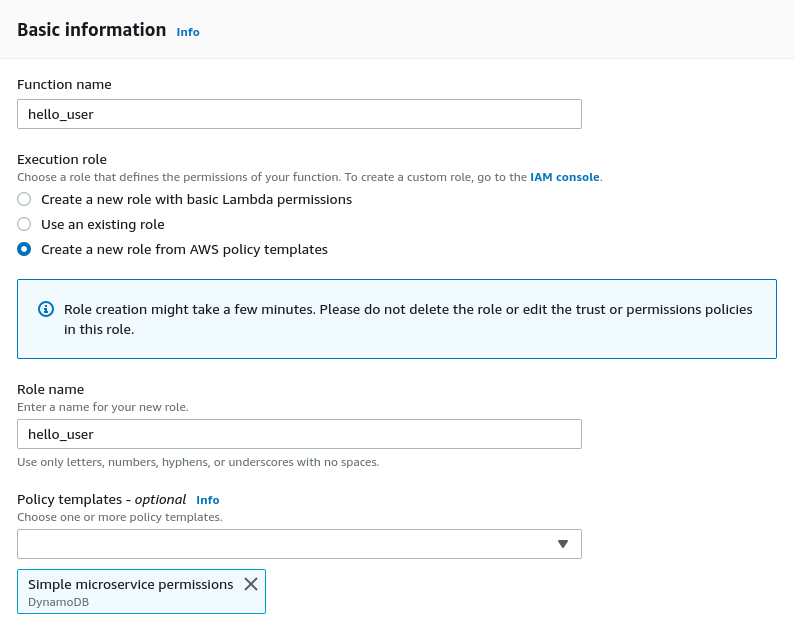
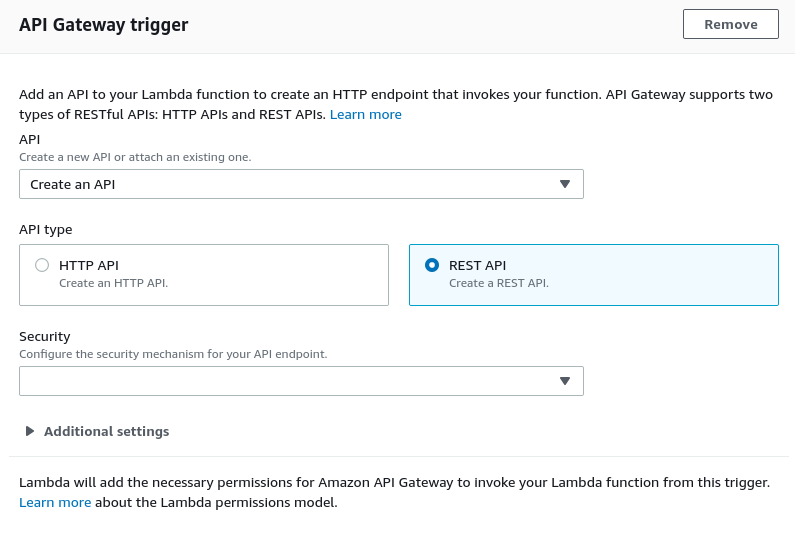
5. Once lambda has been created, navigate to the `Function code` block and select `Upload .zip file` from `Code Entry Type`
dropdown, select zip created in step 3.
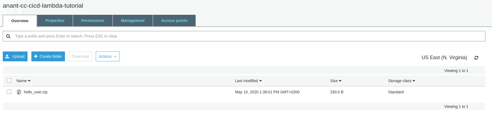
Be sure to change the handler info as given in the image below.
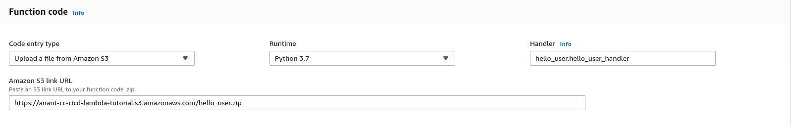
6. Click on the tab API Gateway, as shown in the screen capture below, to obtain the API Endpoint URL.
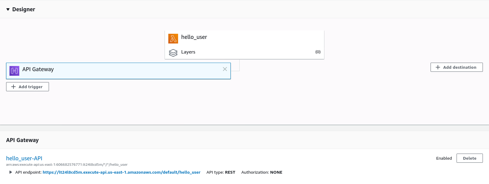
Navigate to the URL and ensure you see the following JSON response.
```json
{"message": "hello user"}
```
With our lambda created we can now move to the next stage of our tutorial.

## Create a Code Build environment for the pipeline
For this purpose, we make use of 'AWS CodeBuild'. This build will be used during during the build stage for the Code Pipeline.

###Steps to follow:
1. Inside the AWS Console search and navigate to the 'AWS CodeBuild.'
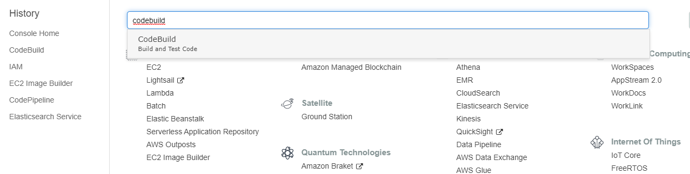

2. Now let's start by creating a new build project by clicking 'Create build project'.

3. To create a build successfully, let us break down and carry it one sub-section at a time.
Starting with the 'Project Configuration'.
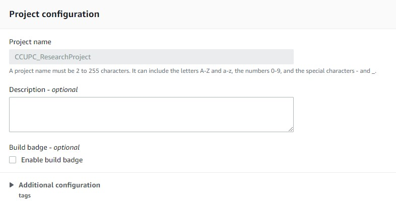

4. Proceeding with the 'Source Details'. In this case, we need make use of the code stored in Github by pointing the AWS to the correct repository. Please choose source provider as 'Github Enterprise.'
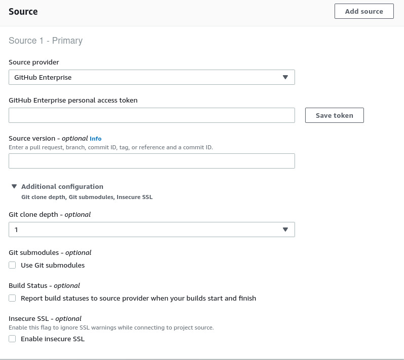
 Additionally, for authentication purposes, we generated 'Personal OAuth token'. This token can be generated from 'developer' tab under the GitHub settings page.
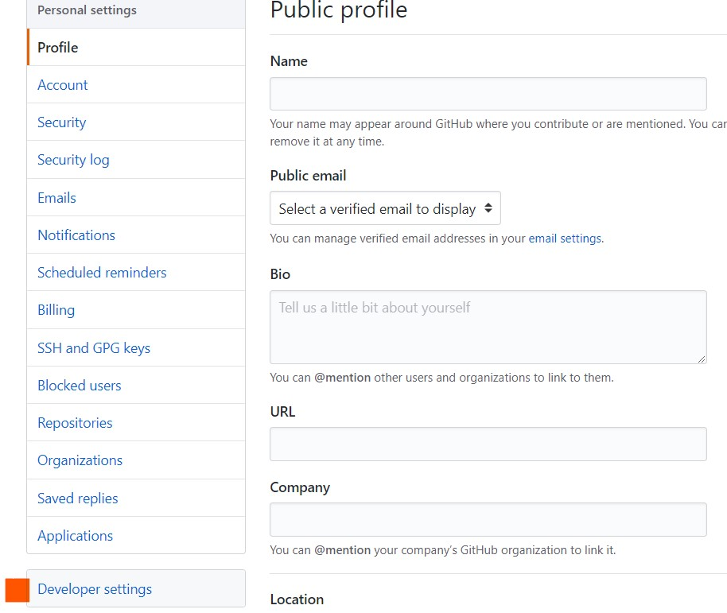
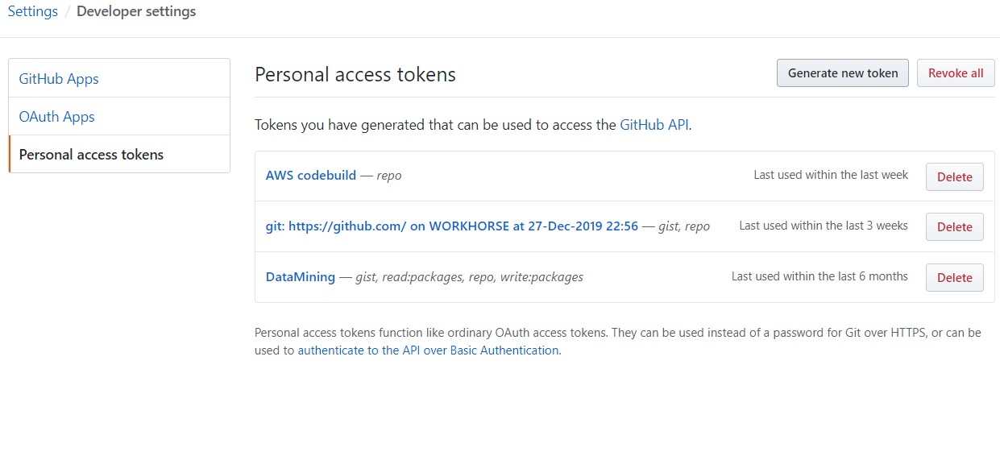
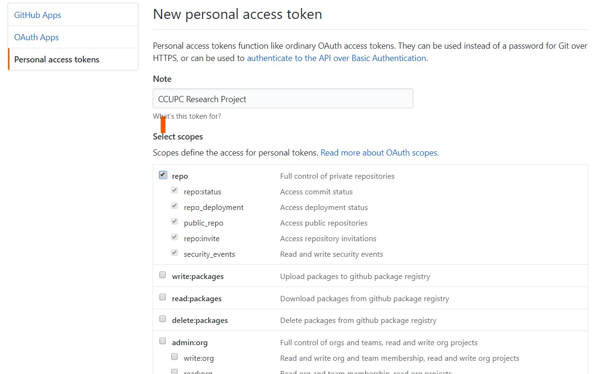
This generated the token needs to pasted under the 'GitHub Enterprise personal access token.'
The source version needs to be 'https://github.com/anantgupta04/CC-ResearchProject.git'
Before proceeding for next stage, please choose the 'Webhook-optional'. Additonal information can be found in the [documentation](https://developer.github.com/webhooks/).
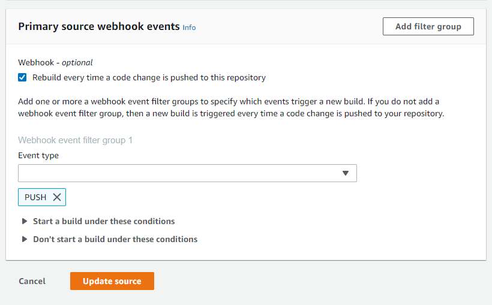

5. We move on the 'Environment' stage. For this execution, we make use of 'Managed Image' and 'Amazon Linux 2 ' as the operating system. Further configurations, can be found as in the following image. We keeping computation power to the minimalistic for reducing costs.


6. Proceeding with the 'Buildspec' level. We do not make any alterations, since we generate the file following the default syntax 'buildspec.yml'. The contents of the yml file:
```
version: 0.2
phases:
  install:
    runtime-versions:
      python: 3.7
  pre_build:
    commands:
      - pip install -r requirements.txt
      - pytest
```

7. For 'Artifacts' stage, we proceed without making any changes since we plan to create the entire program structure as a zip.

8. 'Logs' stage, we continue with the default 'CloudWatch logs-optional.'
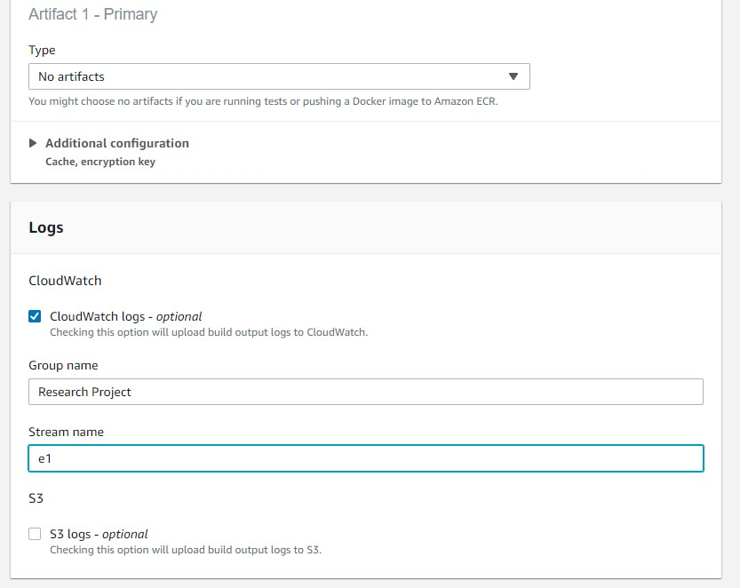

Finally after this detailed configurations, we click 'Create  build project'.
***
