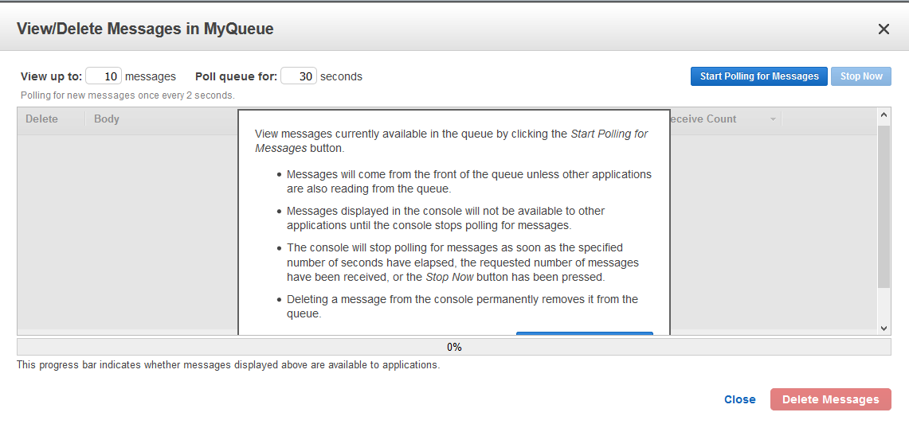
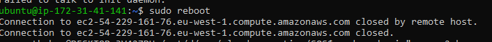
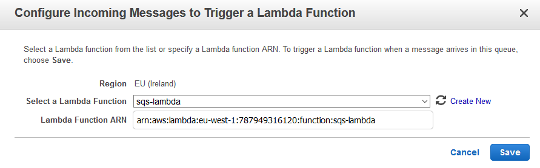
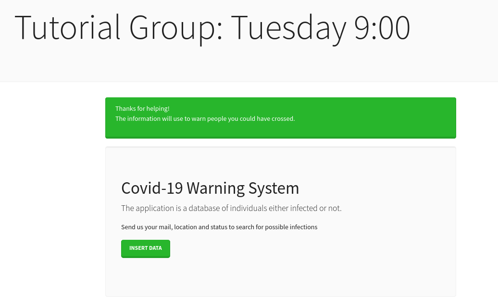
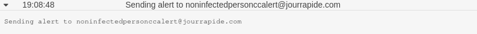

# Implement Amazon Simple Queue Service (SQS) to execute escalable processes according to demand

## Task 1.1: Creating an SQS queue

### Create a queue

The first step was creating a queue. We named it _MyQueue_ and set all the parameters to default.


### Test sending/receiving messages

After having created a queue, we can work with it and try sending and receiving messages. We sent two messages: _MESSAGE 1_ and _MESSAGE 2_.


Now, when the messages have been sent, we can view them. For that, we need to start polling for messages.



We need to press _Start polling for messages_ button.


Now, we can actually view the messages we have sent before: we can see their sizes, timestamp of when they were sent and the contents.

## Task 1.2: Creating a consumer for your queue


### Launch an EC2 instance

Let's launch and an EC2 instance. Since, we have done it many times in our labs, there is no need to show how we did. So, here is our running EC2 instance.


Also, we assigned _AmazonSQSFullAccess_ role to our instance so that it can interact with SQS.


### Periodically fetch messages

Our next step is to programmatically interact with SQS. We used the python script provided in the tutorial for this purpose.
```
#!/usr/bin/python3 -u
import boto3
sqs = boto3.client('sqs')

queue_url = 'sqs_url'

while True:
	messages = sqs.receive_message(
    	QueueUrl=queue_url,
    	MaxNumberOfMessages=1,
    	WaitTimeSeconds=20
	)

	if 'Messages' in messages and messages['Messages']:
    	message = messages['Messages'][0]
    	print(message['Body'])
    	sqs.delete_message(
        	QueueUrl=queue_url,
        	ReceiptHandle=message['ReceiptHandle']
    	)
```

One of the parameters used in the script is queue url which we can get from SQS.


**Check that you can send a message to the queue via the web console interface and that the message is successfully retrieved by the script.**

Let's send a message from SQS and check if we can retrieve it using the script.


OK, the message is sent.


The message is received! The script works correctly!

### Start automatically with instance

To have the script run automatically with the EC2 instance, and to have it automatically restart if it crashes, we need to use _systemd_.  
We created a new file with the following contents:
```
[Unit]
Description=Service to test SQS
After=syslog.target network.target

[Service]
Type=simple
User=ubuntu
Group=ubuntu
WorkingDirectory=/home/ubuntu
ExecStart=/home/ubuntu/script.py
StandardOutput=syslog
StandardError=syslog
Restart=on-failure

[Install]
WantedBy=multi-user.target
```
We gave permissions to the file using `chmod +x script.py`. And, finally move it to `etc/systemd/system`.  
In the tutorial it is said to use the following commands to enable and start the service:
```
sudo systemd enable sqs-test.service
sudo systemd start sqs-test.service
```
However, it did not work for us. After doing some research on the web, we found that the correct commands to be used are:
```
sudo systemctl enable sqs-test.service
sudo systemctl start sqs-test.service
```

**Verify that the script is running by issuing the following command:** `systemctl status sqs-test.service`

OK, the preparation work has been done. Now, let's try running the script and see if everything goes fine.


As you can see, the script is successfully running.

**Using the command `journalctl -u sqs-test.service -b -f`, check that the script’s output can be seen. Also check that the script stops and restarts on reboot without any user intervention.**

To check that the script's output can be seen using the mentioned above command, first we need to send a message.


Now, let's run the command and see what happens.


OK, it is working fine and we can see the output of the script.

Now, let's test if the script stops and restarts on reboot. Let's send a message using SQS.


And reboot the machine.



Now, let's check the logs to see if the script actually stopped and restarted after the reboot.


We can see that it has automatically restarted and retrieved the messaged that had been sent before the reboot.

## Task 1.3: An autoscaling group for your consumers

### Create an autoscaling group

First, we need to create a launch template with a user script that automatically sets up the environment from the previous steps, creating all the files and enabling/starting the service.  

The script
```
#!/bin/sh
cat > /home/ec2-user/script.py << EOF
#!/usr/bin/python3 -u
import boto3
sqs = boto3.client('sqs')

queue_url = 'https://sqs.eu-west-1.amazonaws.com/numbers/MyQueue'

while True:
    messages = sqs.receive_message(QueueUrl=queue_url, MaxNumberOfMessages=1,WaitTimeSeconds=20)
    if 'Messages' in messages and messages['Messages']:
        message = messages['Messages'][0]
        print(message['Body'])
        sqs.delete_message(QueueUrl=queue_url, ReceiptHandle=message['ReceiptHandle'])
EOF

cat > /etc/systemd/system/sqs-test.service << EOF
[Unit]
Description=Service to test SQS
After=syslog.target network.target

[Service]
Type=simple
User=ubuntu
Group=ubuntu
WorkingDirectory=/home/ubuntu
ExecStart=/home/ubuntu/script.py
StandardOutput=syslog
StandardError=syslog
Restart=on-failure

[Install]
WantedBy=multi-user.target
EOF

sudo systemctl enable sqs-test.service
sudo systemctl start sqs-test.service
```
Now, we can create an auto-scaling group


### Create an instance for monitoring

Following [step 1](https://docs.aws.amazon.com/autoscaling/ec2/userguide/as-using-sqs-queue.html) we will programatically retrieve the number of currently running instances in our scaling group, the approximate number of messages in the SQS queue, perform the division and send the result to CloudWatch as a metric.

### Autoscaling based on cloudwatch metric

Following the second (and third) step of the [tutorial](https://docs.aws.amazon.com/autoscaling/ec2/userguide/as-using-sqs-queue.html), we created a target-tracking policy which will allow to automatically scale-out and scale-in depending on the number of messages per instance.

### Optional Task: Edit the python script such that processing a message will take some time. Then create the autoscaling group. Issue many consecutive messages to the queue and check that the autoscaling group scales out to accommodate the new workload, and then scales out as the workload lessens.

Let's test if autoscaling works correctly. First, we edited python script and added `sleep()` function and updated the launch template and the autoscaling group


Then we sent many messages and put load on the instance. For that we used bash script:
```
for i in {1..500}
do
        aws sqs send-message --queue-url https://sqs.eu-west-1.amazonaws.com/787949316120/MyQueue --message-body "message_$i"
done
```
After some time, new instance were created by the asg


Now, let's delete the messages.


And, send just 1 message and see if autoscaling group will terminate extra instances.


And yes, it does scale-in. Everything works!


## Task 1.4: Other improvements in the architecture

### Invisibility timeout

### Optional Task: Try to implement a similar mechanism that keeps extending the visibility timeout of the message while its being processed by your application.

This is done using `ChangeMessageVisibility`. It is needed to be contained in the script so that, while processing the message, it will keep extending the visibility timeout.

### Dead letter queue

**Create a dead letter queue for your own queue. Configure it such that old messages or messages that have been retried too many times end up in it. And set up either SNS or Lambda such that you can be notified somehow of messages that end up in the dead letter queue.**

First of all, we need to create a fifo queue which is necessary to create a dead letter queue. 


Now, we create a dead-queue and we have these queues in SQS


Let's assign a lambda function



and set SQS trigger for the lambda


## Task 1.5: Create a AWS Beanstalk web app to send requests to SQS

### Create IAM Policy, Role and User to send requests to SQS

We created a policy called tutorial_policy with the following permissions:  
+ Service: SQS  
+ Actions: Allow ReceiveMessage and SendMessage  
    


Created IAM role called tutorial_role:  
+ Service: EC2  
+ Attached tutorial_policy, AWSElasticBeanstalkWebTier  


**NOTE**: Tutorial asks for creating a new `user` and injecting their keys into environment but this is not needed as we attach approriate permissions using IAM policy to attach it to instance IAM role.

### Deploy a web application in Elastic Beanstalk using the aws command 

The `eb create` command given in the tutorial does not make use of the instance profile created too. We fix these shortcomings and deploy the app to elastic beanstalk
```sh
eb create --instance_profile tutorial_role --elb-type classic --vpc.elbsubnets eu-west-1a --envvars DEBUG=True,SQS_QUEUE_URL=https://sqs.eu-west-1.amazonaws.com/787949316120/MyQueue,AWS_DEFAULT_REGION=eu-west-1
```
App deployed using ElasticBeanStalk


Role configured with proper permission and we see success message.


Messages are inserted into the queue.


### Send a message to SQS with customer information
We have modified code to write attributes in the message body.


## Task 1.6: Your development - Getting ready for the next step

**Task 1:** Consume from queue and write to DynamoDB
The code for this task is present [here](task/task_1_dynamo.py)
In the screenshot below we see data being inserted into DynamoDB, we use location as key to make task 2 easier for us.


**Task 2:** Alert using contact tracking
We modify script from Task1 to put email address of people to be altered in a new queue and a lambda consumes from this Queue and send email using SES.
Code for lambda can be found [here](task/task_2_ses_lambda.py)

**Steps**:
1. We create Queue for alerting.

2. We make necessary code changes to ingest messages into queue.

3. We create lambda which consume from Queue.

4. We create a new sender email address and verify it, note that for the purpose of this we use disposable email addresses.

5. We update lambda code to send email, not we also add permission to lambda role to consume from queue and send emails.
<br/>Contact Alert Email sent:

CloudWatch Log:

6. Finally we present a screenshot to confirm that queue triggers lambda


**FEEDBACK:**

Apart from the inline feedback we have given, the overall impression of this tutorial is that
1. It contains too many technologies to implement and almost no explanations on how to do so. 
2. Most of the times, just links to the aws tutorial pages, very few screenshots of the process. For example, step 1.6 just enlists tasks and links to help pages and no explanations on how to implement. 
3. We have invested several days in this research project and work very hard, finally we managed to get it done. 
5. Moreover, we get the impression that tutorial creators did not use roles they had created in a proper way, for example in section 1.5 they suggest creating a policy for sending and receiving messages in SQS but then create a user too and ingest user credentials via environment variable.
6. If we were following this tutorial in a context of quickly trying to understand about SQS and auto scaling, we would be lost in the details and would never finish the task at hand.
7. Tutorial could have been structured in a way that the final outcome was solving the self learning. 

Nevertheless, we appreciate the effort put by the authors.

**Grade:**
8.0