# Introuction to Docker and Elastic Container Service (ECS)

## Environment
This tutoirial is being run on MacOS Catalina v10.15.3.

### Q1: Describe where docker finds the image of hello-world?
When the command `docker run hello-world` is run, docker looks for the image `hello-world` in the local machine. If it cannot find the image, it pulls the latest image from the dockerhub library `library/hello-world:latest`. In our case, since it was the first time we ran the docker run command, it pulled the image from the dockerhub.

### Q2: What do you think happened when we call the function run?
When we call the `docker run` function, the docker takes the following steps:

1. The Docker client contacts the Docker daemon.
2. The Docker daemon pulls the "hello-world" image from the Docker Hub.
3. The Docker daemon creates a new container from that image which runs the
    executable that produces the message "Hello from Docker".
4. The Docker daemon streams the output to the Docker client, which sends it
    to the terminal.
    
### Useful Docker Commands
Some useful commands were run to get the familiarization with docker as suggested by the tutorial. The commands and their corresponding output are shown below.

`docker ps` - Shows all containers that are running

Since there are no containers running, the output is empty

`docker ps -a` - Shows the history of containers

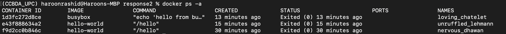

`docker container prune` - Clears all the stopped containers

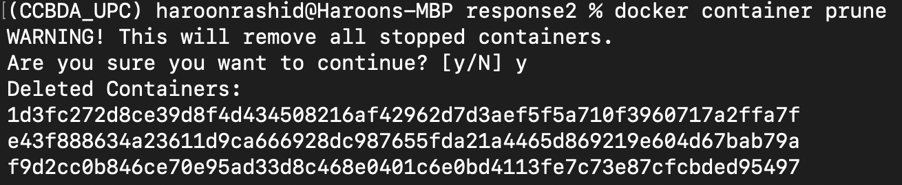

After clearning the containers, `docker ps -a` reponse is also empty

`docker images`- Lists all the images stored locally

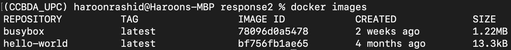

`docker rmi [img ID]` - removes the image with [imgID].

The commands helped us familiarize with the common docker commands to get started with docker.

### Building a Docker Image
To build the docker image, following steps were taken according to the tutorial.

1. Clone the repo `https://github.com/prakhar1989/docker-curriculum.git`
2. cd to `docker-curriculum/flask-app`
3. Run the build command `docker build -t haroonrashid/catnip .`

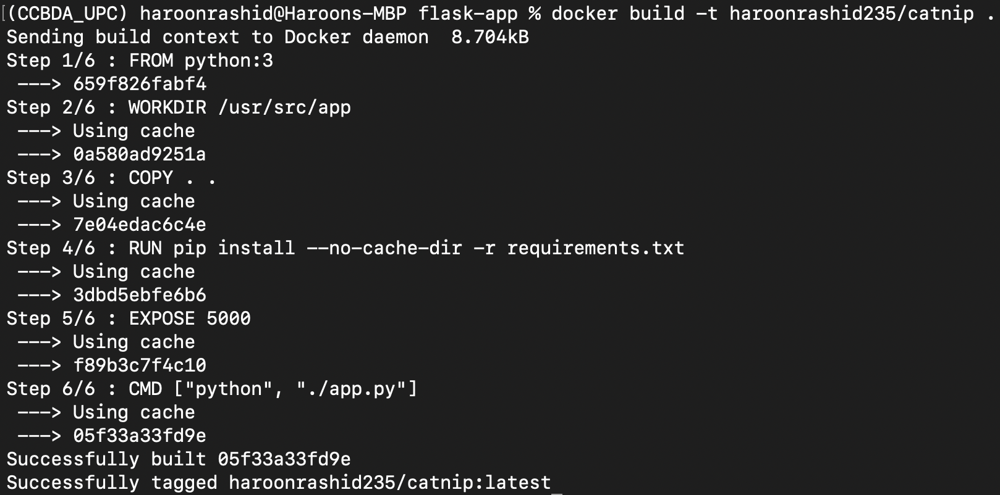

4. The new image that we built can be seen by the `docker images` command whose output is shown below.

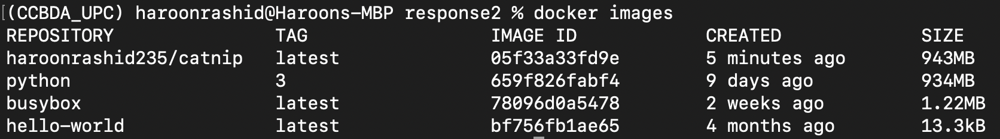

5. The docker image is run using `docker run -p 5000:5000 haroonrashid/catnip`

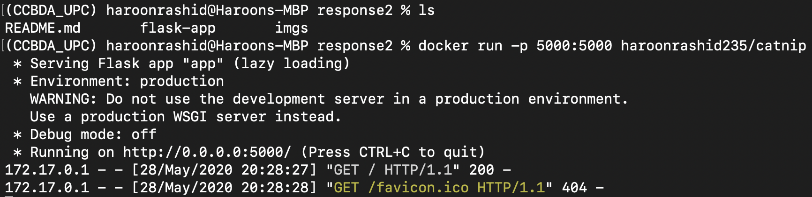

6. The flask app is accessed at `localhost:5000`. The port 5000 is exposed for the app in the dockerfile.

## Deploying Docker on ECS
This part of the tutorial uses multiple docker containers and deploys them on Elastic Container Service (ECS) provided by AWS.

The following steps are taken to build and run the docker image for the foodtrucks-web app.
1. Clone the repo provided by the tutorial's author `https://github.com/aristonhariantolim/cctutorial-foodtruck.git`
2. cd to `cctutorial-foodtruck` and build the docker by running `docker build -t haroonrashid235/foodtrucks-web .`
3. Once the docker is successfully built, it is run locally by using `docker run -p 5000:5000 haroonrashid/foodtrucks-web`
4. Finally docker is pushed to the dockerhub using `docker push haroonrashid235/foodtrucks-23b`

Next, `ecs-cli` is installed on the machine to access the Elastic Container service using the command line.

ECS profile is conifgured for the user's AWS acount, using the user's `access-key` and `secret-access-key`.  
`ecs-cli configure profile --profile-name ecs-foodtrucks --access-key $AWS_ACCESS_KEY_ID --secret-key $AWS_SECRET_ACCESS_KEY`

A key-pair is created that is used to access the ecs-cluster and run tasks on it.
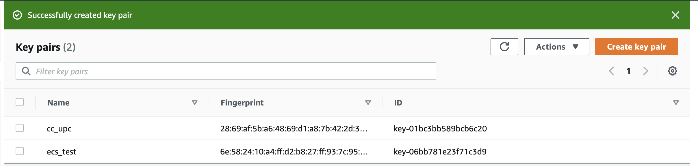

Finally, the cluster is created using the follwing command.

`ecs-cli up --keypair ecs_test --capability-iam --size 1 --instance-type t2.medium`

### Q3: What do you think all the parameters mean?
`--keypair`: Specifies the name of an existing Amazon EC2 key pair to enable SSH access to the EC2 instances in your cluster
`capability-iam`: Acknowledges that this command may create IAM resources
`--size`: Specifies the number of instances to launch and register to the cluster.
`--instance-type`: Specifies the type of EC2 instance to launch.

**Note: There were some issues with the credentials from the ecs-cli and the cluster could not run from the cli. Instead we created the cluster using the AWS console whose process is given below.**

## Creating ECS cluster from the AWS console
AWS provides you with two options to run your containers.
1. Fargate (Network Only): A serverless infrastructure maintained by Amazon ECS i.e. not exactly server less but you do not need to take the pain of maintaining and scaling the server.
2. EC2: We can use Elastic Compute Cloud with ECS to get more control over the server on which your container would be running.

We chose fargate for this tutorial, because it is serverless whose advantages we are well aware of. The steps for creating a cluster and running container on the AWS ECS are given below:

1. We create a cluster by selecting Elastic Container Service from AWS service list, select Clusters and create.
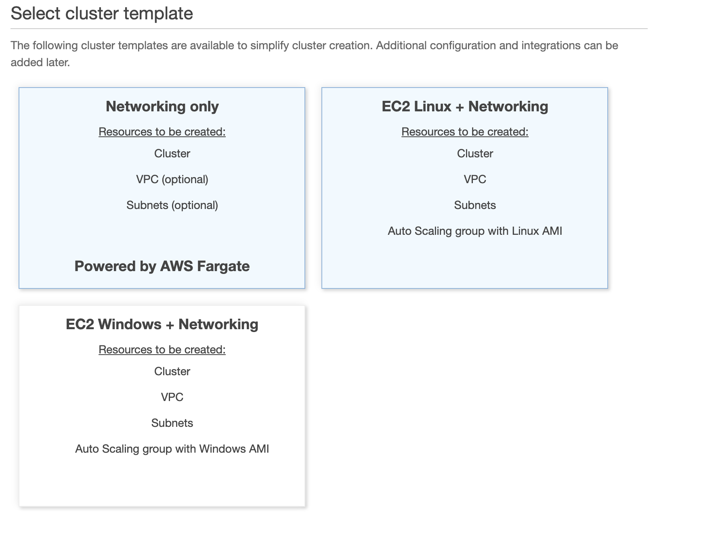

As we are using Fargate in this section the obvious choice is Network Only and proceed with creating a cluster by entering the name of the cluster and networking details.
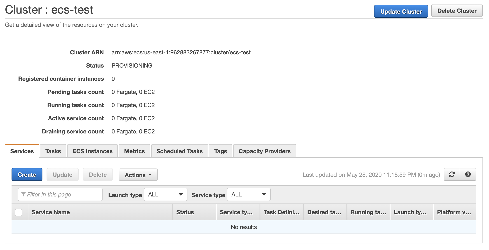

2. Once the cluster is created, we create a task that will be running on the cluster we just created. To create a task move to Task Definitions option on the ECS menu and create a task definition.
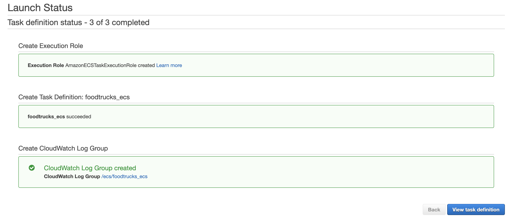

3. Now, we add a container to the task definition. We use Docker hub’s URL if your image is deployed on docker hub.
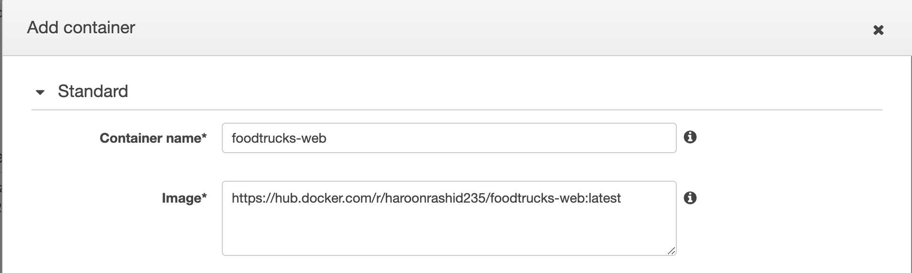

4. Once the container is added,run a new task by clicking on Run new Task and the following screen appears.
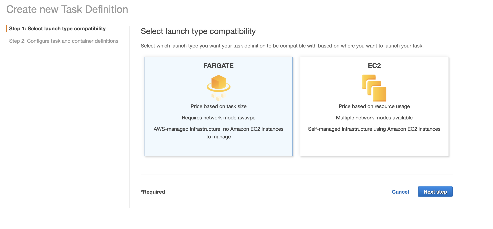

5. Submit the details by clicking on Run. You will be able to view your task listed under the Tasks tab on the cluster with a RUNNING status.
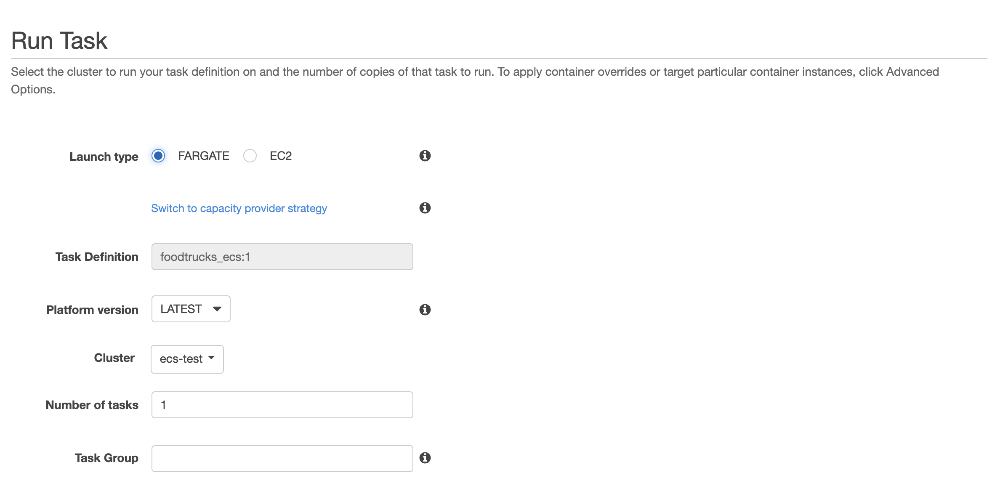

6. You can click on the task and get the details of your running service. In the network section, you can see your public IP where you can see your service running. This is not a static IP and it changes if you restart your task. You can use Amazon ALB to assign an Elastic IP.
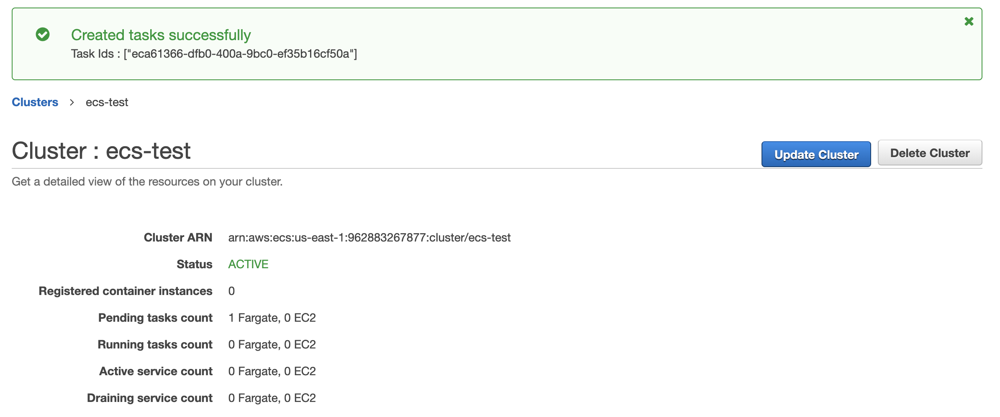
